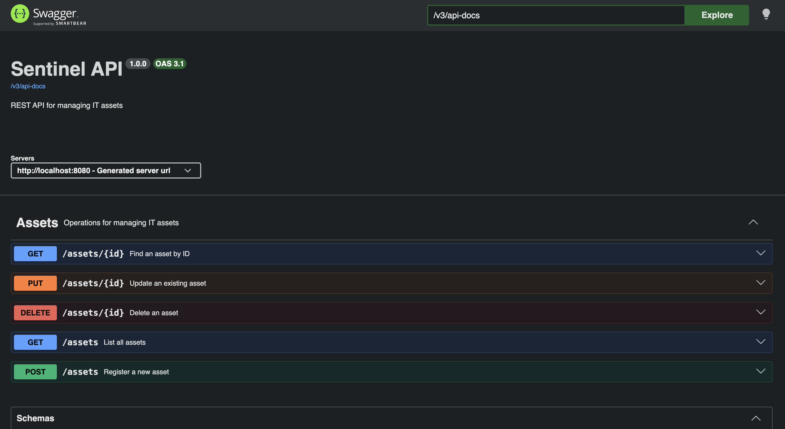
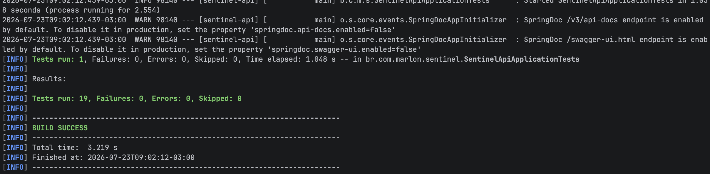

# Sentinel API — Asset Inventory

O **Sentinel** é uma API REST para gerenciamento de ativos de Tecnologia da Informação.

O projeto permite cadastrar, consultar, atualizar e remover computadores, notebooks, servidores e outros equipamentos de uma organização, mantendo essas informações persistidas em um banco de dados PostgreSQL.

A aplicação começou como um sistema Java executado pelo terminal, utilizando JDBC e SQL manual. Após a conclusão dessa primeira etapa, o projeto foi migrado para Spring Boot e passou a utilizar uma arquitetura voltada para APIs REST, com Spring Data JPA, DTOs, validações, tratamento global de exceções, testes automatizados e documentação OpenAPI.

O Sentinel está sendo desenvolvido como parte da minha transição de carreira para a área de tecnologia, inicialmente com foco em desenvolvimento backend Java e com evolução futura planejada para Desenvolvimento Full Stack e Segurança da Informação.

---

## Demonstração da API

A API possui documentação interativa gerada com OpenAPI e Swagger UI.



---

## Funcionalidades atuais

A aplicação permite:

- cadastrar novos ativos;
- listar todos os ativos registrados;
- buscar um ativo pelo ID;
- atualizar as informações de um ativo;
- remover um ativo;
- persistir os dados em PostgreSQL;
- validar os dados recebidos pela API;
- retornar erros padronizados;
- documentar e testar os endpoints pela Swagger UI.

---

## Endpoints

| Método | Endpoint | Descrição |
|---|---|---|
| `GET` | `/assets` | Lista todos os ativos |
| `GET` | `/assets/{id}` | Busca um ativo pelo ID |
| `POST` | `/assets` | Cadastra um novo ativo |
| `PUT` | `/assets/{id}` | Atualiza um ativo existente |
| `DELETE` | `/assets/{id}` | Remove um ativo |

### Respostas HTTP principais

| Código | Significado |
|---|---|
| `200 OK` | Operação realizada com sucesso |
| `400 Bad Request` | Corpo da requisição inválido ou erro de validação |
| `404 Not Found` | Ativo não encontrado |
| `500 Internal Server Error` | Erro interno não esperado |

Nesta fase, os endpoints de criação e remoção retornam `200 OK`. Esses contratos poderão ser refinados futuramente para utilizar códigos como `201 Created` e `204 No Content`.

---

## Modelo de Asset

Cada ativo possui os seguintes campos:

| Campo | Tipo | Descrição |
|---|---|---|
| `id` | `Long` | Identificador gerado pelo banco |
| `hostname` | `String` | Nome do equipamento na rede |
| `ip` | `String` | Endereço IP |
| `operatingSystem` | `String` | Sistema operacional |
| `manufacturer` | `String` | Fabricante |
| `model` | `String` | Modelo do equipamento |
| `responsible` | `String` | Pessoa ou setor responsável |
| `status` | `AssetStatus` | Estado atual do ativo |
| `location` | `String` | Localização física ou lógica |
| `lastLoggedUser` | `String` | Último usuário associado ao ativo |
| `purchaseDate` | `LocalDate` | Data de compra |
| `lastSeen` | `LocalDateTime` | Última vez em que o ativo foi observado |

---

## Status do ativo

O status é representado pelo enum `AssetStatus`.

Valores disponíveis:

- `ACTIVE`
- `INACTIVE`
- `MAINTENANCE`
- `LOST`
- `DISPOSED`

O uso de um enum impede variações inconsistentes de escrita e restringe o campo aos valores reconhecidos pela aplicação.

Em vez de aceitar valores livres como:

```text
ativo
Active
ATIVO
em uso
```

a API trabalha com um conjunto controlado de opções.

---

## Exemplo de requisição

### Cadastro de um ativo

```http
POST /assets
Content-Type: application/json
```

```json
{
  "hostname": "NOTEBOOK-FINANCE-01",
  "ip": "192.168.1.25",
  "operatingSystem": "Windows 11 Pro",
  "manufacturer": "Dell",
  "model": "Latitude 5440",
  "responsible": "Finance Department",
  "status": "ACTIVE",
  "location": "Fortaleza Office",
  "lastLoggedUser": "finance.user",
  "purchaseDate": "2025-03-15",
  "lastSeen": "2026-07-23T08:30:00"
}
```

### Exemplo de resposta

```json
{
  "id": 1,
  "hostname": "NOTEBOOK-FINANCE-01",
  "ip": "192.168.1.25",
  "operatingSystem": "Windows 11 Pro",
  "manufacturer": "Dell",
  "model": "Latitude 5440",
  "responsible": "Finance Department",
  "status": "ACTIVE",
  "location": "Fortaleza Office",
  "lastLoggedUser": "finance.user",
  "purchaseDate": "2025-03-15",
  "lastSeen": "2026-07-23T08:30:00"
}
```

---

## Validação de dados

Os dados recebidos pela API são representados por DTOs específicos:

- `CreateAssetRequest`;
- `UpdateAssetRequest`;
- `AssetResponse`.

Os DTOs de entrada utilizam Bean Validation para impedir que requisições inválidas avancem para a camada de serviço.

Quando uma validação falha, a API retorna uma resposta padronizada com:

- status HTTP;
- mensagem geral;
- campos que apresentaram erro;
- mensagem específica de cada campo.

Exemplo conceitual:

```json
{
  "status": 400,
  "message": "Validation error",
  "errors": {
    "hostname": "Hostname is required",
    "ip": "IP is required"
  }
}
```

O uso de DTOs evita expor diretamente a entidade JPA e permite que o contrato da API evolua de forma mais controlada.

---

## Tratamento de exceções

A aplicação possui tratamento global de exceções utilizando `@RestControllerAdvice`.

Entre os cenários tratados estão:

### Ativo não encontrado

Quando um ID inexistente é consultado, atualizado ou removido:

```json
{
  "status": 404,
  "message": "Asset not found with ID: 99"
}
```

### Corpo da requisição inválido

Quando o JSON enviado não pode ser interpretado:

```json
{
  "status": 400,
  "message": "Invalid request body"
}
```

### Erros de validação

Quando um ou mais campos não atendem às regras definidas:

```json
{
  "status": 400,
  "message": "Validation error",
  "errors": {
    "hostname": "Hostname is required"
  }
}
```

Essa padronização torna as respostas mais previsíveis para aplicações frontend e integrações externas.

---

## Campos com contexto de segurança

Alguns campos foram incluídos pensando na evolução futura do Sentinel para uma plataforma com contexto de Segurança da Informação.

### `lastLoggedUser`

Registra o último usuário associado ao ativo.

Esse dado poderá ser utilizado futuramente para:

- investigações;
- correlação com logs;
- identificação de uso indevido;
- auditoria de acesso;
- análise de alterações suspeitas.

### `lastSeen`

Registra a última vez em que o ativo foi visto ou observado.

Nesta versão, o valor é recebido pela API. Em uma evolução futura, poderá ser atualizado automaticamente por:

- agente instalado no equipamento;
- scanner de rede;
- integração com logs;
- ferramenta de monitoramento;
- solução de inventário automático.

Possíveis cenários futuros:

- ativo marcado como `ACTIVE`, mas não visto há muitos dias;
- equipamento marcado como `DISPOSED`, mas ainda aparecendo na rede;
- máquina desconhecida observada por um scanner;
- divergência entre o inventário registrado e o ambiente real.

### `purchaseDate`

Registra a data de compra ou aquisição do equipamento.

O campo poderá ajudar em:

- análise do ciclo de vida;
- identificação de equipamentos antigos;
- planejamento de substituições;
- correlação com sistemas operacionais sem suporte;
- avaliação de riscos associados a ativos obsoletos.

---

## Tecnologias utilizadas

### Backend

- Java 21
- Spring Boot 4.1
- Spring Web MVC
- Spring Data JPA
- Hibernate
- Bean Validation
- Lombok
- Maven

### Banco de dados

- PostgreSQL
- SQL

### Documentação

- OpenAPI 3.1
- Swagger UI
- Springdoc OpenAPI

### Testes

- JUnit
- Mockito
- MockMvc
- Spring Boot Test

### Ferramentas

- Git
- GitHub
- IntelliJ IDEA

---

## Arquitetura

A aplicação segue uma arquitetura organizada em camadas:

```text
HTTP Request
      ↓
AssetController
      ↓
AssetService
      ↓
AssetRepository
      ↓
Spring Data JPA / Hibernate
      ↓
PostgreSQL
```

### Controller

Responsável por:

- receber requisições HTTP;
- validar DTOs de entrada;
- encaminhar operações para o service;
- retornar DTOs de resposta.

### Service

Responsável por:

- concentrar a lógica da aplicação;
- buscar e manipular ativos;
- converter entidades em DTOs;
- lançar exceções quando necessário;
- intermediar o controller e o repository.

### Repository

Responsável pela comunicação com o banco de dados.

A interface utiliza Spring Data JPA, eliminando a necessidade de escrever manualmente as operações básicas de persistência.

### DTOs

Responsáveis por definir os contratos de entrada e saída da API.

```text
CreateAssetRequest
UpdateAssetRequest
AssetResponse
```

### Entity

A classe `Asset` representa a entidade persistida na tabela `assets`.

### Global exception handler

Centraliza o tratamento de exceções e mantém um padrão para as respostas de erro.

---

## Estrutura principal do projeto

```text
src
├── main
│   ├── java
│   │   └── br.com.marlon.sentinel
│   │       ├── SentinelApiApplication.java
│   │       ├── asset
│   │       │   ├── Asset.java
│   │       │   ├── AssetStatus.java
│   │       │   ├── AssetRepository.java
│   │       │   ├── AssetService.java
│   │       │   ├── AssetController.java
│   │       │   └── dto
│   │       │       ├── CreateAssetRequest.java
│   │       │       ├── UpdateAssetRequest.java
│   │       │       └── AssetResponse.java
│   │       ├── config
│   │       │   └── OpenApiConfig.java
│   │       └── exception
│   │           ├── GlobalExceptionHandler.java
│   │           ├── AssetNotFoundException.java
│   │           ├── ApiErrorResponse.java
│   │           └── ValidationErrorResponse.java
│   └── resources
│       └── application.properties
└── test
    └── java
        └── br.com.marlon.sentinel
            └── asset
                ├── AssetControllerTest.java
                ├── AssetServiceTest.java
                └── SentinelApiApplicationTests.java
```

A estrutura pode sofrer pequenas alterações conforme o projeto evoluir.

---

## Banco de dados

O projeto utiliza PostgreSQL.

Nome sugerido para o banco:

```sql
sentinel
```

Criação do banco:

```sql
CREATE DATABASE sentinel;
```

A entidade `Asset` é mapeada para a tabela:

```text
assets
```

Campos persistidos:

```text
id
hostname
ip
operating_system
manufacturer
model
responsible
status
location
last_logged_user
purchase_date
last_seen
```

---

## Configuração da aplicação

A conexão com o banco deve ser configurada sem inserir credenciais diretamente no repositório.

Variáveis esperadas:

```text
DB_URL
DB_USER
DB_PASSWORD
```

Exemplo:

```text
DB_URL=jdbc:postgresql://localhost:5432/sentinel
DB_USER=postgres
DB_PASSWORD=your_password
```

Exemplo de configuração no `application.properties`:

```properties
spring.datasource.url=${DB_URL}
spring.datasource.username=${DB_USER}
spring.datasource.password=${DB_PASSWORD}
spring.datasource.driver-class-name=org.postgresql.Driver
```

As demais configurações do Hibernate e do JPA devem seguir o arquivo presente no projeto.

---

## Como executar

### Pré-requisitos

Antes de iniciar, instale:

- Java 21;
- PostgreSQL;
- Git.

O projeto possui Maven Wrapper, portanto não é obrigatório instalar o Maven separadamente.

### 1. Clone o repositório

```bash
git clone https://github.com/marlonbrunotech/sentinel-api.git
```

### 2. Acesse a pasta

```bash
cd sentinel-api
```

### 3. Crie o banco PostgreSQL

```sql
CREATE DATABASE sentinel;
```

### 4. Configure as variáveis de ambiente

Linux ou macOS:

```bash
export DB_URL=jdbc:postgresql://localhost:5432/sentinel
export DB_USER=postgres
export DB_PASSWORD=your_password
```

### 5. Execute os testes

```bash
./mvnw test
```

### 6. Inicie a aplicação

```bash
./mvnw spring-boot:run
```

A API ficará disponível em:

```text
http://localhost:8080
```

---

## Documentação OpenAPI

Com a aplicação em execução, acesse:

### Swagger UI

```text
http://localhost:8080/swagger-ui.html
```

### Especificação OpenAPI em JSON

```text
http://localhost:8080/v3/api-docs
```

A Swagger UI permite:

- visualizar todos os endpoints;
- consultar parâmetros;
- visualizar schemas;
- analisar os formatos das respostas;
- executar requisições diretamente pelo navegador.

---

## Testes automatizados

O projeto possui atualmente **19 testes automatizados**.

Distribuição:

| Classe | Quantidade | Escopo |
|---|---:|---|
| `AssetServiceTest` | 8 | Regras e interações da camada de serviço |
| `AssetControllerTest` | 10 | Endpoints, validações, JSON e respostas HTTP |
| `SentinelApiApplicationTests` | 1 | Inicialização do contexto Spring |
| **Total** | **19** | |

Cenários cobertos:

- listagem de ativos;
- busca por ID;
- cadastro;
- atualização;
- remoção;
- ativo não encontrado;
- validação de DTO;
- JSON malformado;
- códigos HTTP;
- respostas de erro;
- interação entre service e repository.

Resultado atual:

```text
Tests run: 19
Failures: 0
Errors: 0
Skipped: 0
BUILD SUCCESS
```



---

## Evolução do projeto

### Primeira etapa — Java Console

A primeira versão do Sentinel foi desenvolvida utilizando:

- Java;
- interface pelo terminal;
- JDBC;
- SQL manual;
- PostgreSQL;
- arquitetura simples em camadas.

O fluxo era:

```text
MainJava
   ↓
MainMenu
   ↓
AssetService
   ↓
AssetRepository
   ↓
DatabaseConnection
   ↓
PostgreSQL
```

Essa etapa foi importante para compreender como a aplicação se comunica diretamente com o banco antes da utilização de frameworks.

### Segunda etapa — Spring Boot REST API

Na etapa atual, o sistema foi transformado em uma API REST com:

- controllers;
- services;
- Spring Data JPA;
- Hibernate;
- DTOs;
- validações;
- tratamento de exceções;
- testes automatizados;
- documentação OpenAPI.

Essa evolução substituiu a interface pelo terminal por endpoints HTTP que podem ser consumidos por um frontend ou por outras aplicações.

---

## Conceitos praticados

Durante o desenvolvimento foram aplicados:

- Programação Orientada a Objetos;
- classes e objetos;
- encapsulamento;
- enums;
- injeção de dependências;
- arquitetura em camadas;
- API REST;
- métodos HTTP;
- DTOs;
- Bean Validation;
- tratamento global de exceções;
- persistência com JPA;
- mapeamento objeto-relacional;
- repositories;
- services;
- controllers;
- serialização e desserialização JSON;
- testes unitários;
- mocks;
- testes de controller;
- documentação OpenAPI;
- variáveis de ambiente;
- Maven;
- Git e GitHub.

---

## Observação sobre remoção de ativos

Atualmente, o endpoint `DELETE` remove o registro fisicamente do banco de dados.

Em um sistema real de inventário, essa abordagem poderia ser substituída por:

- soft delete;
- desativação do ativo;
- alteração do status para `DISPOSED`;
- armazenamento do histórico;
- registro de auditoria.

O delete físico foi mantido nesta etapa para praticar o fluxo completo de um CRUD.

---

## Possíveis evoluções futuras

As próximas etapas ainda serão definidas de acordo com o andamento dos estudos e a disponibilidade para continuar o projeto.

Possibilidades já consideradas:

- regras de unicidade para hostname e IP;
- constraints adicionais no banco;
- paginação e ordenação;
- filtros e pesquisa;
- campos de auditoria;
- autenticação com Spring Security;
- autorização baseada em roles;
- JWT;
- frontend com Angular;
- dashboard;
- logs de auditoria;
- inventário automático;
- integração com scanner de rede;
- recursos relacionados à Segurança da Informação.

Esses itens representam ideias de evolução e não funcionalidades disponíveis na versão atual.

---

## Status atual

```text
Java Console + JDBC + PostgreSQL
                     ↓
Spring Boot REST API + JPA + PostgreSQL
                     ↓
DTOs + Validações + Tratamento de Exceções
                     ↓
19 Testes Automatizados
                     ↓
OpenAPI + Swagger UI
```

Marco atual:

```text
Spring Boot REST API testado e documentado.
```

---

## Autor

Projeto desenvolvido por **Marlon Bruno** como parte da jornada de aprendizado e transição de carreira para a área de tecnologia.

O projeto possui foco atual em desenvolvimento backend com Java e Spring Boot, com evolução futura planejada para Desenvolvimento Full Stack e Segurança da Informação.
